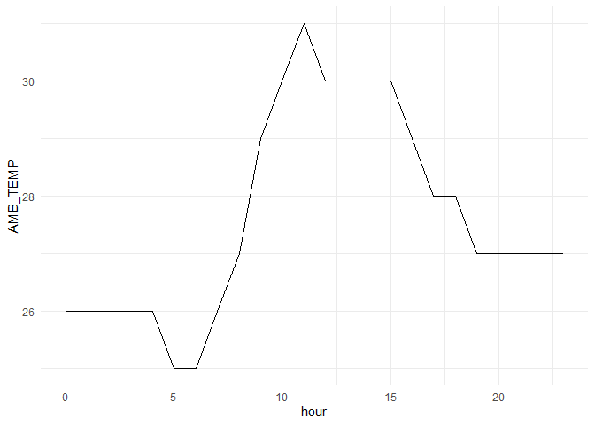
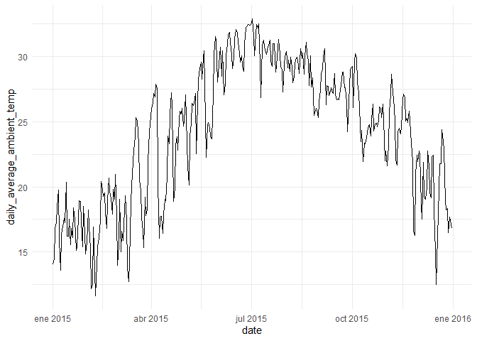
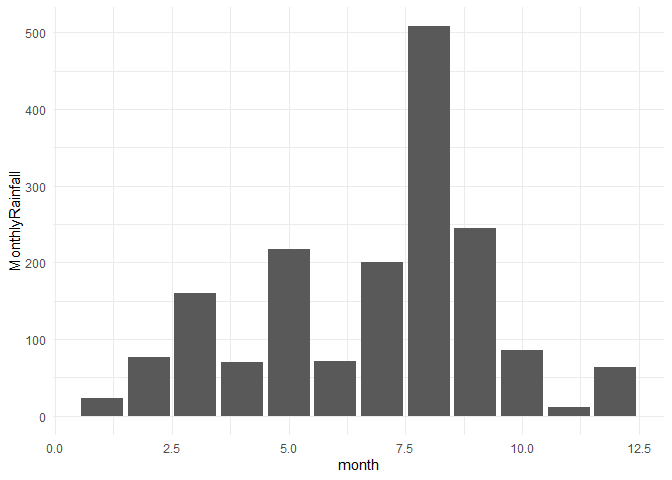
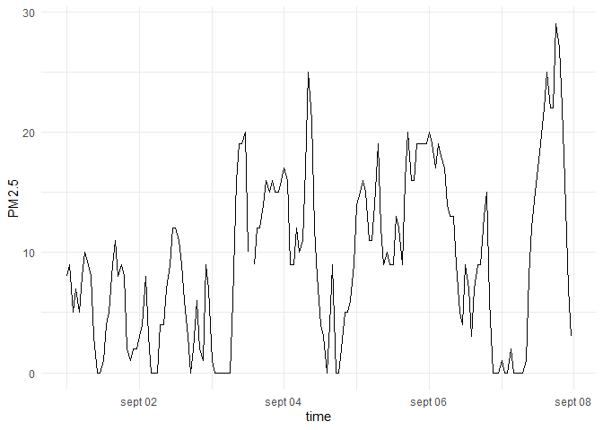

# assignment_6


``` r
library(tidyverse)
```

    ── Attaching core tidyverse packages ──────────────────────── tidyverse 2.0.0 ──
    ✔ dplyr     1.1.4     ✔ readr     2.1.5
    ✔ forcats   1.0.0     ✔ stringr   1.5.1
    ✔ ggplot2   3.5.2     ✔ tibble    3.3.0
    ✔ lubridate 1.9.4     ✔ tidyr     1.3.1
    ✔ purrr     1.1.0     
    ── Conflicts ────────────────────────────────────────── tidyverse_conflicts() ──
    ✖ dplyr::filter() masks stats::filter()
    ✖ dplyr::lag()    masks stats::lag()
    ℹ Use the conflicted package (<http://conflicted.r-lib.org/>) to force all conflicts to become errors

``` r
library(knitr)
```

## **Exercise 1. Tibble and Data Import**

### **1.1**

``` r
tribble(
  ~a, ~b, ~c,
  1, 2.1, "apple",
  2, 3.2, "orange"
)
```

    # A tibble: 2 × 3
          a     b c     
      <dbl> <dbl> <chr> 
    1     1   2.1 apple 
    2     2   3.2 orange

``` r
tibble(
a = c(1, 2),
b = c(2.1, 3.2),
c = c("apple", "orange")
)
```

    # A tibble: 2 × 3
          a     b c     
      <dbl> <dbl> <chr> 
    1     1   2.1 apple 
    2     2   3.2 orange

### **1.2**

``` r
dataset2 <- read_csv("https://raw.githubusercontent.com/nt246/NTRES-6100-data-science/master/datasets/dataset2.txt",
                       col_names = c("Name", "Weight", "Price"))
```

    Rows: 3 Columns: 3
    ── Column specification ────────────────────────────────────────────────────────
    Delimiter: ","
    chr (1): Name
    dbl (2): Weight, Price

    ℹ Use `spec()` to retrieve the full column specification for this data.
    ℹ Specify the column types or set `show_col_types = FALSE` to quiet this message.

``` r
dataset2
```

    # A tibble: 3 × 3
      Name   Weight Price
      <chr>   <dbl> <dbl>
    1 apple       1   2.9
    2 orange      2   4.9
    3 durian     10  19.9

### **1.3**

``` r
dataset3 <- read_csv("https://raw.githubusercontent.com/nt246/NTRES-6100-data-science/master/datasets/dataset3.txt",
                       col_names = c("Name", "Weight", "Price"),
                      )
```

    Rows: 6 Columns: 1
    ── Column specification ────────────────────────────────────────────────────────
    Delimiter: ","
    chr (1): Name

    ℹ Use `spec()` to retrieve the full column specification for this data.
    ℹ Specify the column types or set `show_col_types = FALSE` to quiet this message.

``` r
dataset3
```

    # A tibble: 6 × 1
      Name                    
      <chr>                   
    1 Table of fruits         
    2 09/25/18                
    3 /Name/;/Weight/;/Price/ 
    4 /apple/;1;2.9           
    5 /orange/;2;Not Available
    6 /durian/;?;19.9         

``` r
dataset3.1 <- read_delim("https://raw.githubusercontent.com/nt246/NTRES-6100-data-science/master/datasets/dataset3.txt",
                         delim = ";", 
                         skip = 2,
                         na = c("?", "Not Available"),
                       col_names = c("Name", "Weight", "Price"),
                      )
```

    Rows: 4 Columns: 3
    ── Column specification ────────────────────────────────────────────────────────
    Delimiter: ";"
    chr (3): Name, Weight, Price

    ℹ Use `spec()` to retrieve the full column specification for this data.
    ℹ Specify the column types or set `show_col_types = FALSE` to quiet this message.

``` r
dataset3.1
```

    # A tibble: 4 × 3
      Name     Weight   Price  
      <chr>    <chr>    <chr>  
    1 /Name/   /Weight/ /Price/
    2 /apple/  1        2.9    
    3 /orange/ 2        <NA>   
    4 /durian/ <NA>     19.9   

## **Exercise 2. Weather station**

### 2.1

``` r
weather_notes <- read_delim("https://raw.githubusercontent.com/nt246/NTRES-6100-data-science/master/datasets/2015y_Weather_Station_notes.txt",
                delim = "-"                          )
```

    Rows: 15 Columns: 3
    ── Column specification ────────────────────────────────────────────────────────
    Delimiter: "-"
    chr (3): Item, Unit, Description

    ℹ Use `spec()` to retrieve the full column specification for this data.
    ℹ Specify the column types or set `show_col_types = FALSE` to quiet this message.

``` r
weather_notes |>
  kable()
```

| Item | Unit | Description |
|:---|:---|:---|
| AMB_TEMP | Celsius | Ambient air temperature |
| CO | ppm | Carbon monoxide |
| NO | ppb | Nitric oxide |
| NO2 | ppb | Nitrogen dioxide |
| NOx | ppb | Nitrogen oxides |
| O3 | ppb | Ozone |
| PM10 | μg/m3 | Particulate matter with a diameter between 2.5 and 10 μm |
| PM2.5 | μg/m3 | Particulate matter with a diameter of 2.5 μm or less |
| RAINFALL | mm | Rainfall |
| RH | % | Relative humidity |
| SO2 | ppb | Sulfur dioxide |
| WD_HR | degress | Wind direction (The average of hour) |
| WIND_DIREC | degress | Wind direction (The average of last ten minutes per hour) |
| WIND_SPEED | m/sec | Wind speed (The average of last ten minutes per hour) |
| WS_HR | m/sec | Wind speed (The average of hour) |

### 2.2

``` r
weather <- read_csv("https://raw.githubusercontent.com/nt246/NTRES-6100-data-science/master/datasets/2015y_Weather_Station.csv")
```

    Warning: One or more parsing issues, call `problems()` on your data frame for details,
    e.g.:
      dat <- vroom(...)
      problems(dat)

    Rows: 5460 Columns: 27
    ── Column specification ────────────────────────────────────────────────────────
    Delimiter: ","
    chr  (15): station, item, 04, 08, 09, 10, 11, 12, 13, 14, 15, 16, 17, 18, 20
    dbl  (11): 00, 01, 02, 03, 05, 06, 07, 19, 21, 22, 23
    date  (1): date

    ℹ Use `spec()` to retrieve the full column specification for this data.
    ℹ Specify the column types or set `show_col_types = FALSE` to quiet this message.

``` r
view(weather)
```

``` r
weather_clean1 <- weather |>
  pivot_longer(cols = `00`:`23`, 
               names_to = "hour", 
               values_to = "value",
               values_transform = list(value = as.character))
view(weather_clean1)
```

``` r
weather_clean2 <- weather_clean1 |>
  mutate(value = ifelse(value == "NR", "0", value)) |>
  mutate(hour = parse_number(hour))
view(weather_clean2)
```

``` r
weather_clean3 <- weather_clean2 |> 
pivot_wider(names_from = item, 
              values_from = value) |> 
   mutate(AMB_TEMP = parse_double(AMB_TEMP))
```

    Warning: There was 1 warning in `mutate()`.
    ℹ In argument: `AMB_TEMP = parse_double(AMB_TEMP)`.
    Caused by warning:
    ! 16 parsing failures.
     row col               expected actual
     201  -- no trailing characters    15#
    2939  -- no trailing characters    23#
    3850  -- no trailing characters    33#
    3858  -- no trailing characters    34#
    5031  -- no trailing characters    30#
    .... ... ...................... ......
    See problems(...) for more details.

``` r
weather_clean3 |>
head(6)
```

    # A tibble: 6 × 18
      date       station  hour AMB_TEMP CO    NO    NO2   NOx   O3    PM10  PM2.5
      <date>     <chr>   <dbl>    <dbl> <chr> <chr> <chr> <chr> <chr> <chr> <chr>
    1 2015-01-01 Cailiao     0       16 0.74  1     15    16    35    171   76   
    2 2015-01-01 Cailiao     1       16 0.7   0.8   13    14    36    174   78   
    3 2015-01-01 Cailiao     2       15 0.66  1.1   13    14    35    160   69   
    4 2015-01-01 Cailiao     3       15 0.61  1.7   12    13    34    142   60   
    5 2015-01-01 Cailiao     4       15 0.51  2     11    13    34    123   52   
    6 2015-01-01 Cailiao     5       14 0.51  1.7   13    15    32    110   44   
    # ℹ 7 more variables: RAINFALL <chr>, RH <chr>, SO2 <chr>, WD_HR <chr>,
    #   WIND_DIREC <chr>, WIND_SPEED <chr>, WS_HR <chr>

``` r
view(weather_clean3)
```

### 2.3

``` r
weather_clean3 |>
  filter(date == as.Date("2015-09-25")) |>
  ggplot(aes(x = hour, y = AMB_TEMP, group = 1)) +
  geom_line() +
  labs(x = "hour",
       y = "AMB_TEMP") +
  theme_minimal()
```



### 2.4

``` r
weather_clean3 |>
  group_by(date) |>
  summarize(daily_average_ambient_temp = mean(AMB_TEMP, na.rm = TRUE)) |>
  ggplot(aes(x = date, y = daily_average_ambient_temp)) +
  geom_line() +
  labs(x = "date",
       y = "daily_average_ambient_temp") +
  theme_minimal()
```



### 2.5

``` r
weather_clean3 |>
  mutate(RAINFALL = parse_number(RAINFALL)) |>
  mutate(month = month(date)) |>
  group_by(month) |>
  summarize(MonthlyRainfall = sum(RAINFALL, na.rm = TRUE)) |>
  ggplot(aes(x = month, y = MonthlyRainfall)) +
  geom_col() +
  labs(x = "month",
       y = "MonthlyRainfall") +
  theme_minimal()
```



### 2.6

``` r
weather_clean3 |>
  filter(between(date, as.Date("2015-09-01"), as.Date("2015-09-07"))) |>
  mutate(
    PM2.5 = parse_number(PM2.5),
    datetime = parse_date_time(paste(date, hour), orders = "ymd H")) |>
  ggplot(aes(x = datetime, y = PM2.5)) +
  geom_line() +
  labs(x = "time", y = "PM2.5") +
  theme_minimal()
```


