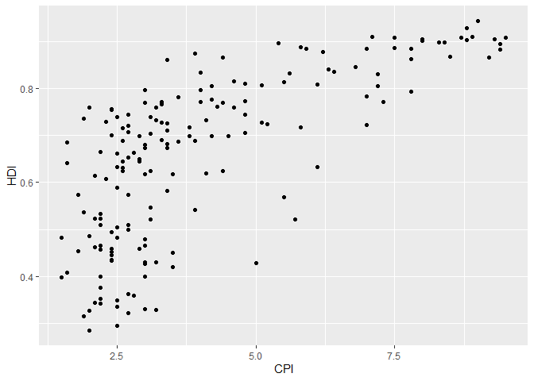

# Assignment 4


``` r
library(tidyverse) 
```

    ── Attaching core tidyverse packages ──────────────────────── tidyverse 2.0.0 ──
    ✔ dplyr     1.1.4     ✔ readr     2.1.5
    ✔ forcats   1.0.0     ✔ stringr   1.5.1
    ✔ ggplot2   3.5.2     ✔ tibble    3.3.0
    ✔ lubridate 1.9.4     ✔ tidyr     1.3.1
    ✔ purrr     1.1.0     
    ── Conflicts ────────────────────────────────────────── tidyverse_conflicts() ──
    ✖ dplyr::filter() masks stats::filter()
    ✖ dplyr::lag()    masks stats::lag()
    ℹ Use the conflicted package (<http://conflicted.r-lib.org/>) to force all conflicts to become errors

``` r
library(knitr)
library(ggplot2)
```

## Exercise 1. Corruption and human development

``` r
economist_data<-read_csv("https://raw.githubusercontent.com/nt246/NTRES-6100-data-science/master/datasets/EconomistData.csv")
```

    New names:
    Rows: 173 Columns: 6
    ── Column specification
    ──────────────────────────────────────────────────────── Delimiter: "," chr
    (2): Country, Region dbl (4): ...1, HDI.Rank, HDI, CPI
    ℹ Use `spec()` to retrieve the full column specification for this data. ℹ
    Specify the column types or set `show_col_types = FALSE` to quiet this message.
    • `` -> `...1`

#### **1.1 Show the first few rows of `economist_data`.**

``` r
head(economist_data) |>  
kable()
```

|  …1 | Country     | HDI.Rank |   HDI | CPI | Region            |
|----:|:------------|---------:|------:|----:|:------------------|
|   1 | Afghanistan |      172 | 0.398 | 1.5 | Asia Pacific      |
|   2 | Albania     |       70 | 0.739 | 3.1 | East EU Cemt Asia |
|   3 | Algeria     |       96 | 0.698 | 2.9 | MENA              |
|   4 | Angola      |      148 | 0.486 | 2.0 | SSA               |
|   5 | Argentina   |       45 | 0.797 | 3.0 | Americas          |
|   6 | Armenia     |       86 | 0.716 | 2.6 | East EU Cemt Asia |

#### **1.2 Expore the relationship between human development index (`HDI`) and corruption perception index (`CPI`) with a scatter plot as the following.**

``` r
economist_data |> 
  ggplot(mapping = aes(x=CPI, y=HDI)) + 
  geom_point()
```



#### **1.3 Make the color of all points in the previous plot red.**

``` r
economist_data |> 
  ggplot(mapping = aes(x=CPI, y=HDI, color="red")) + 
  geom_point()
```


#### **1.4 Color the points in the previous plot according to the `Region` variable, and set the size of points to 2.**

``` r
economist_data |> 
  ggplot(mapping = aes(x=CPI, y=HDI, color= Region, size= 2)) + 
  geom_point()
```


#### **1.5 Set the size of the points proportional to `HDI.Rank`**

``` r
economist_data |> 
  ggplot(mapping = aes(x=CPI, y=HDI, color= Region, size = HDI.Rank)) + 
  geom_point()
```


#### **1.6 Fit a smoothing line to all the data points in the scatter plot from Excercise 1.4**

``` r
economist_data |>
ggplot(mapping=aes(x=CPI, y=HDI))+
  geom_point(mapping=aes(x=CPI, y=HDI, color= Region)) +
  geom_smooth()
```

    `geom_smooth()` using method = 'loess' and formula = 'y ~ x'


#### **1.7 Fit a separate straight line for each region instead, and turn off the confidence interval.**

``` r
economist_data |>
  ggplot(mapping = aes(x = CPI, y = HDI, color = Region)) +
  geom_point() +
  geom_smooth(method = "lm", se = FALSE)
```

    `geom_smooth()` using formula = 'y ~ x'


#### **1.8 Building on top of the previous plot, show each `Region` in a different facet.**

``` r
economist_data |>
  ggplot(mapping = aes(x = CPI, y = HDI, color = Region)) +
  geom_point() +
  geom_smooth(method = "lm", se = FALSE) +
  facet_wrap(~Region, nrow = 2)
```

    `geom_smooth()` using formula = 'y ~ x'


#### **1.9 Show the distribution of `HDI` in each region using density plot. Set the transparency to 0.5**

``` r
economist_data |>
  ggplot(aes(x = HDI, fill = Region)) +
  geom_density(alpha = 0.5)
```


#### **1.10 Show the distribution of `HDI` in each region using histogram and facetting.**

``` r
economist_data |>
  ggplot(aes(x = HDI, fill = Region)) +
  geom_histogram(binwidth = 0.02) +
  facet_wrap(~Region, nrow = 2)
```


#### **1.11 Show the distribution of `HDI` in each region using a box plot. Set the transparency of these boxes to 0.5 and do not show outlier points with the box plot. Instead, show all data points for each country in the same plot. (Hint: `geom_jitter()` or `position_jitter()` might be useful.)**

``` r
economist_data |>
  ggplot(aes(x = Region, y = HDI, fill = Region)) +
  geom_boxplot(alpha = 0.5, outlier.shape = NA) +
  geom_jitter(width = 0.2, size = 2, alpha = 0.7)
```


#### **1.12 Show the count of countries in each region using a bar plot.**

``` r
economist_data |>
  ggplot(aes(x = Region, fill = Region)) +
  geom_bar() +
  labs(y = "Number of countries", x = "Region")
```


#### **1.13 You have now created a variety of different plots of the same dataset. Which of your plots do you think are the most informative? Describe briefly the major trends that you see in the data.**

Answer: The most informative plots are the scatter plot with regional
coloring (1.4), the faceted regression lines (1.8), and the box plot
with jittered points (1.11). These plots reveal several key trends:

1.  There’s a positive relationship between CPI (less corruption) and
    HDI (higher human development), suggesting that countries with less
    corruption tend to have better human development outcomes.

2.  Countries from the same regions tend to cluster together, with EU W.
    Europe generally showing high CPI and HDI values, while Sub-Saharan
    Africa shows lower values on both indices.

3.  The faceted regression lines show that while the positive
    relationship holds across most regions, the strength and slope vary
    by region.

4.  The box plot clearly shows that regions like EU W. Europe and
    Americas have higher median HDI values with less variability, while
    regions like Sub-Saharan Africa show lower median values with
    greater spread.

## **Exercise 2. Theophylline experiment**

This exercise uses the `Theoph` data frame (comes with your R
installation), which has 132 rows and 5 columns of data from an
experiment on the pharmacokinetics of the anti-asthmatic drug
theophylline. Twelve subjects were given oral doses of theophylline then
serum concentrations were measured at 11 time points over the next 25
hours. You can learn more about this dataset by running `?Theoph`

``` r
library(dplyr)
library(knitr)
```

Have a look at the data structure

``` r
kable(head(Theoph))
```

| Subject |   Wt | Dose | Time |  conc |
|:--------|-----:|-----:|-----:|------:|
| 1       | 79.6 | 4.02 | 0.00 |  0.74 |
| 1       | 79.6 | 4.02 | 0.25 |  2.84 |
| 1       | 79.6 | 4.02 | 0.57 |  6.57 |
| 1       | 79.6 | 4.02 | 1.12 | 10.50 |
| 1       | 79.6 | 4.02 | 2.02 |  9.66 |
| 1       | 79.6 | 4.02 | 3.82 |  8.58 |

For the following exercise, **transform the data as instructed**. Try to
use `tidyverse` functions even if you are more comfortable with base-R
solutions. Show the **first 6 lines** of the transformed data in a table
through RMarkdown **using the kable() function**, as shown above.

#### **2.1 Select columns that contain a lower case “t” in the `Theoph` dataset. Do not manually list all the columns to include.**

``` r
Theoph |>
  select(matches("t", ignore.case = FALSE)) |>
  head() |>
  kable()
```

| Subject |   Wt |
|:--------|-----:|
| 1       | 79.6 |
| 1       | 79.6 |
| 1       | 79.6 |
| 1       | 79.6 |
| 1       | 79.6 |
| 1       | 79.6 |

#### **2.2 Rename the `Wt` column to `Weight` and `conc` column to `Concentration` in the `Theoph` dataset.**

``` r
Theoph |>
  rename(
    Weight = Wt,
    Concentration = conc
  ) |>
  head() |>
  kable()
```

| Subject | Weight | Dose | Time | Concentration |
|:--------|-------:|-----:|-----:|--------------:|
| 1       |   79.6 | 4.02 | 0.00 |          0.74 |
| 1       |   79.6 | 4.02 | 0.25 |          2.84 |
| 1       |   79.6 | 4.02 | 0.57 |          6.57 |
| 1       |   79.6 | 4.02 | 1.12 |         10.50 |
| 1       |   79.6 | 4.02 | 2.02 |          9.66 |
| 1       |   79.6 | 4.02 | 3.82 |          8.58 |

#### **2.3 Extract the `Dose` greater than 4.5 and `Time` greater than the mean `Time`.**

``` r
Theoph |>
  filter(Dose > 0.5, 
  Time > mean(Time)
  ) |>
  head() |>
  kable()
```

| Subject |   Wt | Dose |  Time | conc |
|:--------|-----:|-----:|------:|-----:|
| 1       | 79.6 | 4.02 |  7.03 | 7.47 |
| 1       | 79.6 | 4.02 |  9.05 | 6.89 |
| 1       | 79.6 | 4.02 | 12.12 | 5.94 |
| 1       | 79.6 | 4.02 | 24.37 | 3.28 |
| 2       | 72.4 | 4.40 |  7.03 | 5.40 |
| 2       | 72.4 | 4.40 |  9.00 | 4.55 |

#### **2.4 Sort the `Theoph` dataset by `Wt` from smallest to largest and secondarily by Time from largest to smallest.**

``` r
Theoph |>
  arrange(Wt, 
  -Time)|>
  head() |>
  kable()
```

| Subject |   Wt | Dose |  Time | conc |
|:--------|-----:|-----:|------:|-----:|
| 5       | 54.6 | 5.86 | 24.35 | 1.57 |
| 5       | 54.6 | 5.86 | 12.00 | 4.37 |
| 5       | 54.6 | 5.86 |  9.10 | 5.90 |
| 5       | 54.6 | 5.86 |  7.02 | 7.09 |
| 5       | 54.6 | 5.86 |  5.02 | 7.56 |
| 5       | 54.6 | 5.86 |  3.50 | 8.74 |

#### **2.5 Create a new column called `Quantity` that equals to `Wt` x `Dose` in the `Theoph` dataset. This will tell you the absolute quantity of drug administered to the subject (in mg). Replace the `Dose` variable with `Quantity`.**

``` r
Theoph |>
  mutate(Quantity = Wt * Dose, .after = Wt) |>
  select(-Dose) |>
  head() |>
  kable()
```

| Subject |   Wt | Quantity | Time |  conc |
|:--------|-----:|---------:|-----:|------:|
| 1       | 79.6 |  319.992 | 0.00 |  0.74 |
| 1       | 79.6 |  319.992 | 0.25 |  2.84 |
| 1       | 79.6 |  319.992 | 0.57 |  6.57 |
| 1       | 79.6 |  319.992 | 1.12 | 10.50 |
| 1       | 79.6 |  319.992 | 2.02 |  9.66 |
| 1       | 79.6 |  319.992 | 3.82 |  8.58 |

#### **2.6 Find the mean `conc` and sum of the `Dose` received by each test subject.**

Show data for the 6 subjects with the smallest sum of `Dose` as below.
**Do not define new intermediate objects for this exercise; use pipes to
chain together functions.**

``` r
Theoph |>
  group_by(Subject) |>
  summarise(mean_conc = mean(conc),
            sum_Dose = sum(Dose)) |>
  arrange(sum_Dose) |>
  head(6) |>
  kable()
```

| Subject | mean_conc | sum_Dose |
|:--------|----------:|---------:|
| 9       |  4.893636 |    34.10 |
| 6       |  3.525454 |    44.00 |
| 1       |  6.439091 |    44.22 |
| 2       |  4.823636 |    48.40 |
| 4       |  4.940000 |    48.40 |
| 8       |  4.271818 |    49.83 |
