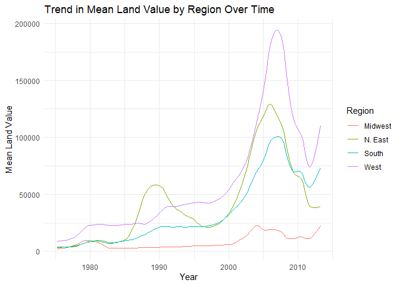
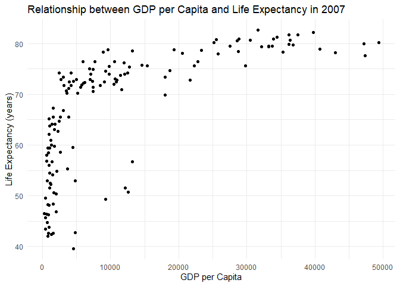
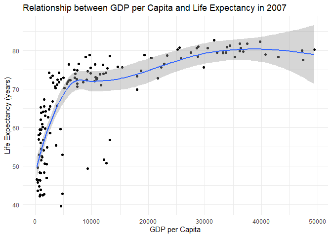
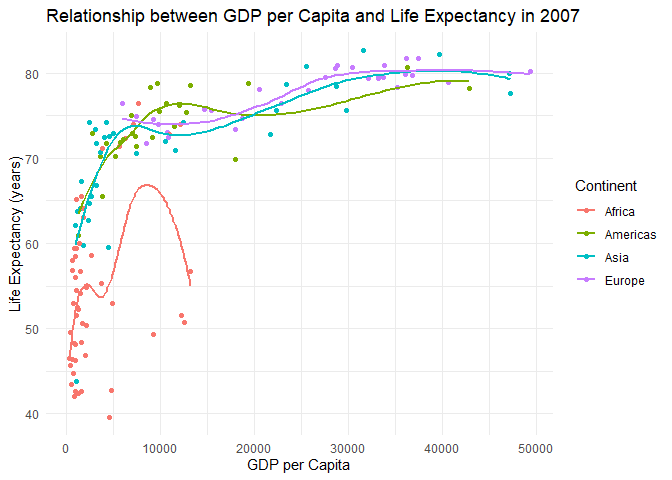
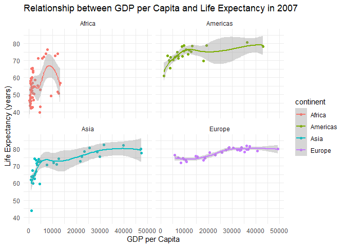
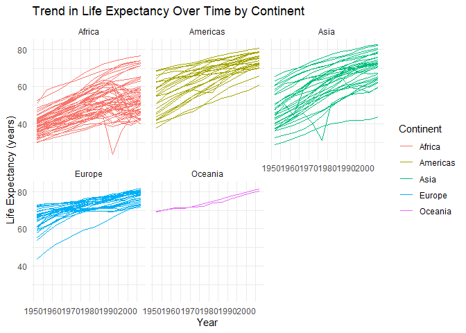

# assignment_5


``` r
library(tidyverse)
```

    ── Attaching core tidyverse packages ──────────────────────── tidyverse 2.0.0 ──
    ✔ dplyr     1.1.4     ✔ readr     2.1.5
    ✔ forcats   1.0.0     ✔ stringr   1.5.1
    ✔ ggplot2   3.5.2     ✔ tibble    3.3.0
    ✔ lubridate 1.9.4     ✔ tidyr     1.3.1
    ✔ purrr     1.1.0     
    ── Conflicts ────────────────────────────────────────── tidyverse_conflicts() ──
    ✖ dplyr::filter() masks stats::filter()
    ✖ dplyr::lag()    masks stats::lag()
    ℹ Use the conflicted package (<http://conflicted.r-lib.org/>) to force all conflicts to become errors

``` r
library(knitr)
##install.packages("gapminder")
library(gapminder)
```

## **Exercise 1. Trends in land value**

This excercise uses a dataset that describes the trends in land value
(`Land.Value`), among other variables, in different states in the US
1975-2013. The states are grouped into four different regions, under the
variable `region`. This dataset was obtained from the Data Science
Services of Harvard University.

``` r
housing <- read_csv("https://raw.githubusercontent.com/nt246/NTRES-6100-data-science/master/datasets/landdata_states.csv")
```

    Rows: 7803 Columns: 11
    ── Column specification ────────────────────────────────────────────────────────
    Delimiter: ","
    chr (2): State, region
    dbl (9): Date, Home.Value, Structure.Cost, Land.Value, Land.Share..Pct., Hom...

    ℹ Use `spec()` to retrieve the full column specification for this data.
    ℹ Specify the column types or set `show_col_types = FALSE` to quiet this message.

``` r
housing |> 
  head() |> 
  kable()
```

| State | region | Date | Home.Value | Structure.Cost | Land.Value | Land.Share..Pct. | Home.Price.Index | Land.Price.Index | Year | Qrtr |
|:---|:---|---:|---:|---:|---:|---:|---:|---:|---:|---:|
| AK | West | 2010.25 | 224952 | 160599 | 64352 | 28.6 | 1.481 | 1.552 | 2010 | 1 |
| AK | West | 2010.50 | 225511 | 160252 | 65259 | 28.9 | 1.484 | 1.576 | 2010 | 2 |
| AK | West | 2009.75 | 225820 | 163791 | 62029 | 27.5 | 1.486 | 1.494 | 2009 | 3 |
| AK | West | 2010.00 | 224994 | 161787 | 63207 | 28.1 | 1.481 | 1.524 | 2009 | 4 |
| AK | West | 2008.00 | 234590 | 155400 | 79190 | 33.8 | 1.544 | 1.885 | 2007 | 4 |
| AK | West | 2008.25 | 233714 | 157458 | 76256 | 32.6 | 1.538 | 1.817 | 2008 | 1 |

``` r
view(housing)
```

#### **1.1 Washington DC was not assigned to a region in this dataset. According to the United States Census Bureau, however, DC is part of the South region. Here:**

    ###### **Change the region of DC to “South” (Hint: there are multiple ways to do this, but `mutate()` and `ifelse()` might be helpful)**

    ###### **Create a new tibble or regular dataframe consisting of this new updated `region` variable along with the original variables `State`, `Date` and `Land.Value` (and no others)**

``` r
housing_updated <- housing |>
  mutate(region = ifelse(State == "DC", "South", region)) |>
  select(State, Date, region, Land.Value)
```

    ###### **Pull out the records from DC in this new data frame. How many records are there from DC? Show the first 6 lines.**

``` r
dc_records <- housing_updated |> 
  filter(State == "DC")  
```

#### **1.2 Generate a tibble/dataframe that summarizes the mean land value of each region at each time point and show its first 6 lines.**

``` r
land_summary <- housing_updated |> 
  group_by(region, Date) |> 
  summarise(mean_land_value = mean(Land.Value, na.rm = TRUE), 
            .groups = "drop")
```

``` r
land_summary |> 
  head(6) |> 
  view()
```

#### **1.3 Using the tibble/dataframe from 1.2, plot the trend in mean land value of each region through time.**

``` r
land_summary |>
  ggplot(aes(x = Date, y = mean_land_value, color = region)) +
  geom_line() +
  labs(title = "Trend in Mean Land Value by Region Over Time",
       x = "Year",
       y = "Mean Land Value",
       color = "Region") +
  theme_minimal()
```



## **Exercise 2. Life expectancy and GDP per capita 1952-2007**

This exercise uses the `gapminder` dataset from the `gapminder` package.
It describes the life expectancy (`lifeExp`), GDP per capita
(`gdpPercap`), and population (`pop`) of 142 countries from 1952 to
2007. These countries can be grouped into 5 continents. As a reminder,
**reproduce the following plots exactly as shown**.

``` r
gapminder |> 
  head() |> 
  kable()
```

| country     | continent | year | lifeExp |      pop | gdpPercap |
|:------------|:----------|-----:|--------:|---------:|----------:|
| Afghanistan | Asia      | 1952 |  28.801 |  8425333 |  779.4453 |
| Afghanistan | Asia      | 1957 |  30.332 |  9240934 |  820.8530 |
| Afghanistan | Asia      | 1962 |  31.997 | 10267083 |  853.1007 |
| Afghanistan | Asia      | 1967 |  34.020 | 11537966 |  836.1971 |
| Afghanistan | Asia      | 1972 |  36.088 | 13079460 |  739.9811 |
| Afghanistan | Asia      | 1977 |  38.438 | 14880372 |  786.1134 |

#### **2.1 Use a scatterplot to explore the relationship between per capita GDP (`gdpPercap`) and life expectancy (`lifeExp`) in the year 2007.**

``` r
gapminder |>
  filter(year == 2007) |>
  ggplot(aes(x = gdpPercap, y = lifeExp)) +
  geom_point() +
  labs(title = "Relationship between GDP per Capita and Life Expectancy in 2007",
       x = "GDP per Capita",
       y = "Life Expectancy (years)") +
  theme_minimal()
```



#### **2.2 Add a smoothing line to the previous plot.**

``` r
gapminder |>
  filter(year == 2007) |>
  ggplot(aes(x = gdpPercap, y = lifeExp)) +
  geom_point() +
  geom_smooth() +
  labs(title = "Relationship between GDP per Capita and Life Expectancy in 2007",
       x = "GDP per Capita",
       y = "Life Expectancy (years)") +
  theme_minimal()
```

    `geom_smooth()` using method = 'loess' and formula = 'y ~ x'



#### **2.3 Exclude Oceania from the previous plot, show each continent in a different color, and fit a separate smoothing line to each continent to identify differences in this relationship between continents. Turn off the confidence intervals.**

``` r
gapminder |>
  filter(year == 2007, continent != "Oceania") |>
  ggplot(aes(x = gdpPercap, y = lifeExp, color = continent)) +
  geom_point() +
  geom_smooth(se = FALSE) +
  labs(title = "Relationship between GDP per Capita and Life Expectancy in 2007",
       x = "GDP per Capita",
       y = "Life Expectancy (years)",
       color = "Continent") +
  theme_minimal()
```

    `geom_smooth()` using method = 'loess' and formula = 'y ~ x'



#### **2.4 Use faceting to solve the same problem. Include the confidence intervals in this plot.**

``` r
gapminder |>
  filter(year == 2007, continent != "Oceania") |>
  ggplot(aes(x = gdpPercap, y = lifeExp, color = continent)) +
  geom_point() +
  geom_smooth() +
  facet_wrap(~ continent) +
  labs(title = "Relationship between GDP per Capita and Life Expectancy in 2007",
       x = "GDP per Capita",
       y = "Life Expectancy (years)") +
  theme_minimal()
```

    `geom_smooth()` using method = 'loess' and formula = 'y ~ x'



#### **2.5 Explore the trend in life expectancy through time in each continent. Color by continent.**

``` r
gapminder |>
  ggplot(aes(x = year, y = lifeExp, color = continent, group = country)) +
  geom_line() +
  facet_wrap(~ continent) +
  labs(title = "Trend in Life Expectancy Over Time by Continent",
       x = "Year",
       y = "Life Expectancy (years)",
       color = "Continent") +
  theme_minimal()
```



#### **2.6 From the previous plot, we see some abnormal trends in Asia and Africa, where the the life expectancy in some countries sharply dropped at certain time periods. Here, we look into what happened in Asia in more detail. First, create a new dataset by filtering only the Asian countries. Show the first 6 lines of this filtered dataset.**

``` r
asia <- gapminder |>
  filter(continent == "Asia")
```

``` r
asia |>
  head() |>
  kable()
```

| country     | continent | year | lifeExp |      pop | gdpPercap |
|:------------|:----------|-----:|--------:|---------:|----------:|
| Afghanistan | Asia      | 1952 |  28.801 |  8425333 |  779.4453 |
| Afghanistan | Asia      | 1957 |  30.332 |  9240934 |  820.8530 |
| Afghanistan | Asia      | 1962 |  31.997 | 10267083 |  853.1007 |
| Afghanistan | Asia      | 1967 |  34.020 | 11537966 |  836.1971 |
| Afghanistan | Asia      | 1972 |  36.088 | 13079460 |  739.9811 |
| Afghanistan | Asia      | 1977 |  38.438 | 14880372 |  786.1134 |

#### **2.7 Using the filtered dataset, identify the countries that had abnormal trends in life expectancy by plotting, and discuss historical events possibly explaining these trends. (Hint: facet by country)**

By plotting life expectancy by country using facets, several Asian
countries show abrupt drops:

- Cambodia

- China

- Afghanistan

- Vietnam

Some historical events (genocides, famines, wars) explain the dramatic
declines in life expectancy during those periods.
